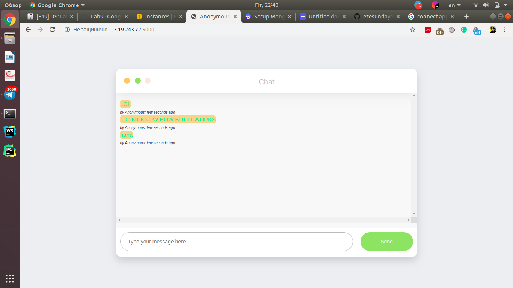
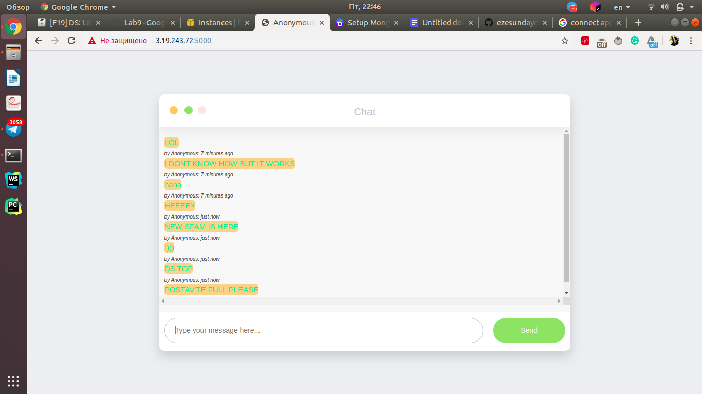

# Anonymous Real-time Chat

## Initial rs.status()
```json
rs0:PRIMARY> rs.status()
{
	"set" : "rs0",
	"date" : ISODate("2019-11-01T19:39:29.584Z"),
	"myState" : 1,
	"term" : NumberLong(1),
	"syncingTo" : "",
	"syncSourceHost" : "",
	"syncSourceId" : -1,
	"heartbeatIntervalMillis" : NumberLong(2000),
	"majorityVoteCount" : 2,
	"writeMajorityCount" : 2,
	"optimes" : {
		"lastCommittedOpTime" : {
			"ts" : Timestamp(1572637162, 1),
			"t" : NumberLong(1)
		},
		"lastCommittedWallTime" : ISODate("2019-11-01T19:39:22.839Z"),
		"readConcernMajorityOpTime" : {
			"ts" : Timestamp(1572637162, 1),
			"t" : NumberLong(1)
		},
		"readConcernMajorityWallTime" : ISODate("2019-11-01T19:39:22.839Z"),
		"appliedOpTime" : {
			"ts" : Timestamp(1572637162, 1),
			"t" : NumberLong(1)
		},
		"durableOpTime" : {
			"ts" : Timestamp(1572637162, 1),
			"t" : NumberLong(1)
		},
		"lastAppliedWallTime" : ISODate("2019-11-01T19:39:22.839Z"),
		"lastDurableWallTime" : ISODate("2019-11-01T19:39:22.839Z")
	},
	"lastStableRecoveryTimestamp" : Timestamp(1572637152, 1),
	"lastStableCheckpointTimestamp" : Timestamp(1572637152, 1),
	"electionCandidateMetrics" : {
		"lastElectionReason" : "electionTimeout",
		"lastElectionDate" : ISODate("2019-11-01T19:16:11.754Z"),
		"termAtElection" : NumberLong(1),
		"lastCommittedOpTimeAtElection" : {
			"ts" : Timestamp(0, 0),
			"t" : NumberLong(-1)
		},
		"lastSeenOpTimeAtElection" : {
			"ts" : Timestamp(1572635771, 1),
			"t" : NumberLong(-1)
		},
		"numVotesNeeded" : 1,
		"priorityAtElection" : 1,
		"electionTimeoutMillis" : NumberLong(10000),
		"newTermStartDate" : ISODate("2019-11-01T19:16:12.798Z"),
		"wMajorityWriteAvailabilityDate" : ISODate("2019-11-01T19:16:12.849Z")
	},
	"members" : [
		{
			"_id" : 0,
			"name" : "172.31.38.173:27017",
			"ip" : "172.31.38.173",
			"health" : 1,
			"state" : 1,
			"stateStr" : "PRIMARY",
			"uptime" : 1570,
			"optime" : {
				"ts" : Timestamp(1572637162, 1),
				"t" : NumberLong(1)
			},
			"optimeDate" : ISODate("2019-11-01T19:39:22Z"),
			"syncingTo" : "",
			"syncSourceHost" : "",
			"syncSourceId" : -1,
			"infoMessage" : "",
			"electionTime" : Timestamp(1572635771, 2),
			"electionDate" : ISODate("2019-11-01T19:16:11Z"),
			"configVersion" : 3,
			"self" : true,
			"lastHeartbeatMessage" : ""
		},
		{
			"_id" : 1,
			"name" : "172.31.39.147:27017",
			"ip" : "172.31.39.147",
			"health" : 1,
			"state" : 2,
			"stateStr" : "SECONDARY",
			"uptime" : 419,
			"optime" : {
				"ts" : Timestamp(1572637162, 1),
				"t" : NumberLong(1)
			},
			"optimeDurable" : {
				"ts" : Timestamp(1572637162, 1),
				"t" : NumberLong(1)
			},
			"optimeDate" : ISODate("2019-11-01T19:39:22Z"),
			"optimeDurableDate" : ISODate("2019-11-01T19:39:22Z"),
			"lastHeartbeat" : ISODate("2019-11-01T19:39:27.935Z"),
			"lastHeartbeatRecv" : ISODate("2019-11-01T19:39:27.768Z"),
			"pingMs" : NumberLong(0),
			"lastHeartbeatMessage" : "",
			"syncingTo" : "172.31.38.173:27017",
			"syncSourceHost" : "172.31.38.173:27017",
			"syncSourceId" : 0,
			"infoMessage" : "",
			"configVersion" : 3
		},
		{
			"_id" : 2,
			"name" : "172.31.30.79:27017",
			"ip" : "172.31.30.79",
			"health" : 1,
			"state" : 2,
			"stateStr" : "SECONDARY",
			"uptime" : 1285,
			"optime" : {
				"ts" : Timestamp(1572637162, 1),
				"t" : NumberLong(1)
			},
			"optimeDurable" : {
				"ts" : Timestamp(1572637162, 1),
				"t" : NumberLong(1)
			},
			"optimeDate" : ISODate("2019-11-01T19:39:22Z"),
			"optimeDurableDate" : ISODate("2019-11-01T19:39:22Z"),
			"lastHeartbeat" : ISODate("2019-11-01T19:39:28.292Z"),
			"lastHeartbeatRecv" : ISODate("2019-11-01T19:39:27.692Z"),
			"pingMs" : NumberLong(0),
			"lastHeartbeatMessage" : "",
			"syncingTo" : "172.31.38.173:27017",
			"syncSourceHost" : "172.31.38.173:27017",
			"syncSourceId" : 0,
			"infoMessage" : "",
			"configVersion" : 3
		}
	],
	"ok" : 1,
	"$clusterTime" : {
		"clusterTime" : Timestamp(1572637162, 1),
		"signature" : {
			"hash" : BinData(0,"AAAAAAAAAAAAAAAAAAAAAAAAAAA="),
			"keyId" : NumberLong(0)
		}
	},
	"operationTime" : Timestamp(1572637162, 1)
}
```

## Initial rs.config()
```json
rs0:PRIMARY> rs.config()
{
	"_id" : "rs0",
	"version" : 3,
	"protocolVersion" : NumberLong(1),
	"writeConcernMajorityJournalDefault" : true,
	"members" : [
		{
			"_id" : 0,
			"host" : "172.31.38.173:27017",
			"arbiterOnly" : false,
			"buildIndexes" : true,
			"hidden" : false,
			"priority" : 1,
			"tags" : {
				
			},
			"slaveDelay" : NumberLong(0),
			"votes" : 1
		},
		{
			"_id" : 1,
			"host" : "172.31.39.147:27017",
			"arbiterOnly" : false,
			"buildIndexes" : true,
			"hidden" : false,
			"priority" : 1,
			"tags" : {
				
			},
			"slaveDelay" : NumberLong(0),
			"votes" : 1
		},
		{
			"_id" : 2,
			"host" : "172.31.30.79:27017",
			"arbiterOnly" : false,
			"buildIndexes" : true,
			"hidden" : false,
			"priority" : 1,
			"tags" : {
				
			},
			"slaveDelay" : NumberLong(0),
			"votes" : 1
		}
	],
	"settings" : {
		"chainingAllowed" : true,
		"heartbeatIntervalMillis" : 2000,
		"heartbeatTimeoutSecs" : 10,
		"electionTimeoutMillis" : 10000,
		"catchUpTimeoutMillis" : -1,
		"catchUpTakeoverDelayMillis" : 30000,
		"getLastErrorModes" : {
			
		},
		"getLastErrorDefaults" : {
			"w" : 1,
			"wtimeout" : 0
		},
		"replicaSetId" : ObjectId("5dbc847bd782697d3233dd8f")
	}
}
```

## Initial spam


## After shutting down PRIMARY rs.status()
```json
rs0:PRIMARY> rs.status()
{
	"set" : "rs0",
	"date" : ISODate("2019-11-01T19:44:08.861Z"),
	"myState" : 1,
	"term" : NumberLong(2),
	"syncingTo" : "",
	"syncSourceHost" : "",
	"syncSourceId" : -1,
	"heartbeatIntervalMillis" : NumberLong(2000),
	"majorityVoteCount" : 2,
	"writeMajorityCount" : 2,
	"optimes" : {
		"lastCommittedOpTime" : {
			"ts" : Timestamp(1572637440, 1),
			"t" : NumberLong(2)
		},
		"lastCommittedWallTime" : ISODate("2019-11-01T19:44:00.853Z"),
		"readConcernMajorityOpTime" : {
			"ts" : Timestamp(1572637440, 1),
			"t" : NumberLong(2)
		},
		"readConcernMajorityWallTime" : ISODate("2019-11-01T19:44:00.853Z"),
		"appliedOpTime" : {
			"ts" : Timestamp(1572637440, 1),
			"t" : NumberLong(2)
		},
		"durableOpTime" : {
			"ts" : Timestamp(1572637440, 1),
			"t" : NumberLong(2)
		},
		"lastAppliedWallTime" : ISODate("2019-11-01T19:44:00.853Z"),
		"lastDurableWallTime" : ISODate("2019-11-01T19:44:00.853Z")
	},
	"lastStableRecoveryTimestamp" : Timestamp(1572637400, 1),
	"lastStableCheckpointTimestamp" : Timestamp(1572637400, 1),
	"electionCandidateMetrics" : {
		"lastElectionReason" : "stepUpRequestSkipDryRun",
		"lastElectionDate" : ISODate("2019-11-01T19:41:30.321Z"),
		"termAtElection" : NumberLong(2),
		"lastCommittedOpTimeAtElection" : {
			"ts" : Timestamp(1572637282, 1),
			"t" : NumberLong(1)
		},
		"lastSeenOpTimeAtElection" : {
			"ts" : Timestamp(1572637282, 1),
			"t" : NumberLong(1)
		},
		"numVotesNeeded" : 2,
		"priorityAtElection" : 1,
		"electionTimeoutMillis" : NumberLong(10000),
		"priorPrimaryMemberId" : 0,
		"numCatchUpOps" : NumberLong(-696717888),
		"newTermStartDate" : ISODate("2019-11-01T19:41:30.847Z"),
		"wMajorityWriteAvailabilityDate" : ISODate("2019-11-01T19:41:32.015Z")
	},
	"members" : [
		{
			"_id" : 0,
			"name" : "172.31.38.173:27017",
			"ip" : "172.31.38.173",
			"health" : 0,
			"state" : 8,
			"stateStr" : "(not reachable/healthy)",
			"uptime" : 0,
			"optime" : {
				"ts" : Timestamp(0, 0),
				"t" : NumberLong(-1)
			},
			"optimeDurable" : {
				"ts" : Timestamp(0, 0),
				"t" : NumberLong(-1)
			},
			"optimeDate" : ISODate("1970-01-01T00:00:00Z"),
			"optimeDurableDate" : ISODate("1970-01-01T00:00:00Z"),
			"lastHeartbeat" : ISODate("2019-11-01T19:44:08.426Z"),
			"lastHeartbeatRecv" : ISODate("2019-11-01T19:41:29.976Z"),
			"pingMs" : NumberLong(0),
			"lastHeartbeatMessage" : "Error connecting to 172.31.38.173:27017 :: caused by :: Connection refused",
			"syncingTo" : "",
			"syncSourceHost" : "",
			"syncSourceId" : -1,
			"infoMessage" : "",
			"configVersion" : -1
		},
		{
			"_id" : 1,
			"name" : "172.31.39.147:27017",
			"ip" : "172.31.39.147",
			"health" : 1,
			"state" : 1,
			"stateStr" : "PRIMARY",
			"uptime" : 701,
			"optime" : {
				"ts" : Timestamp(1572637440, 1),
				"t" : NumberLong(2)
			},
			"optimeDate" : ISODate("2019-11-01T19:44:00Z"),
			"syncingTo" : "",
			"syncSourceHost" : "",
			"syncSourceId" : -1,
			"infoMessage" : "",
			"electionTime" : Timestamp(1572637290, 1),
			"electionDate" : ISODate("2019-11-01T19:41:30Z"),
			"configVersion" : 3,
			"self" : true,
			"lastHeartbeatMessage" : ""
		},
		{
			"_id" : 2,
			"name" : "172.31.30.79:27017",
			"ip" : "172.31.30.79",
			"health" : 1,
			"state" : 2,
			"stateStr" : "SECONDARY",
			"uptime" : 699,
			"optime" : {
				"ts" : Timestamp(1572637440, 1),
				"t" : NumberLong(2)
			},
			"optimeDurable" : {
				"ts" : Timestamp(1572637440, 1),
				"t" : NumberLong(2)
			},
			"optimeDate" : ISODate("2019-11-01T19:44:00Z"),
			"optimeDurableDate" : ISODate("2019-11-01T19:44:00Z"),
			"lastHeartbeat" : ISODate("2019-11-01T19:44:08.407Z"),
			"lastHeartbeatRecv" : ISODate("2019-11-01T19:44:08.088Z"),
			"pingMs" : NumberLong(0),
			"lastHeartbeatMessage" : "",
			"syncingTo" : "172.31.39.147:27017",
			"syncSourceHost" : "172.31.39.147:27017",
			"syncSourceId" : 1,
			"infoMessage" : "",
			"configVersion" : 3
		}
	],
	"ok" : 1,
	"$clusterTime" : {
		"clusterTime" : Timestamp(1572637440, 1),
		"signature" : {
			"hash" : BinData(0,"AAAAAAAAAAAAAAAAAAAAAAAAAAA="),
			"keyId" : NumberLong(0)
		}
	},
	"operationTime" : Timestamp(1572637440, 1)
}
```

## After shutting down PRIMARY rs.config()
```json
rs0:PRIMARY> rs.config()
{
	"_id" : "rs0",
	"version" : 3,
	"protocolVersion" : NumberLong(1),
	"writeConcernMajorityJournalDefault" : true,
	"members" : [
		{
			"_id" : 0,
			"host" : "172.31.38.173:27017",
			"arbiterOnly" : false,
			"buildIndexes" : true,
			"hidden" : false,
			"priority" : 1,
			"tags" : {
				
			},
			"slaveDelay" : NumberLong(0),
			"votes" : 1
		},
		{
			"_id" : 1,
			"host" : "172.31.39.147:27017",
			"arbiterOnly" : false,
			"buildIndexes" : true,
			"hidden" : false,
			"priority" : 1,
			"tags" : {
				
			},
			"slaveDelay" : NumberLong(0),
			"votes" : 1
		},
		{
			"_id" : 2,
			"host" : "172.31.30.79:27017",
			"arbiterOnly" : false,
			"buildIndexes" : true,
			"hidden" : false,
			"priority" : 1,
			"tags" : {
				
			},
			"slaveDelay" : NumberLong(0),
			"votes" : 1
		}
	],
	"settings" : {
		"chainingAllowed" : true,
		"heartbeatIntervalMillis" : 2000,
		"heartbeatTimeoutSecs" : 10,
		"electionTimeoutMillis" : 10000,
		"catchUpTimeoutMillis" : -1,
		"catchUpTakeoverDelayMillis" : 30000,
		"getLastErrorModes" : {
			
		},
		"getLastErrorDefaults" : {
			"w" : 1,
			"wtimeout" : 0
		},
		"replicaSetId" : ObjectId("5dbc847bd782697d3233dd8f")
	}
}
```
## New spam
